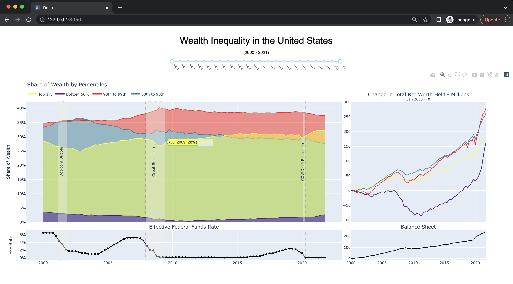
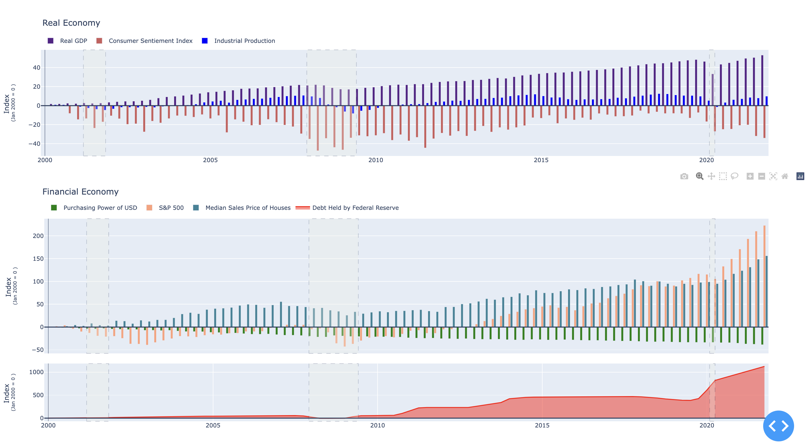
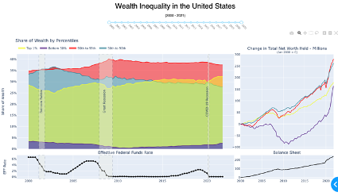
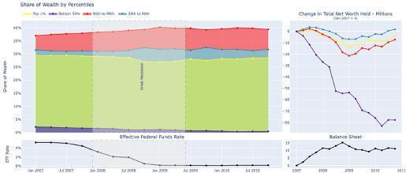
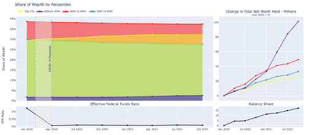
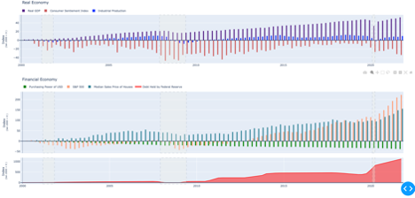
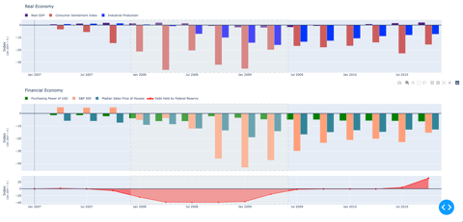
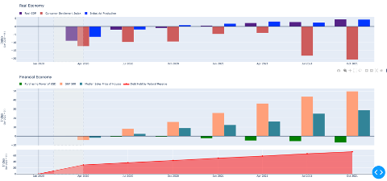
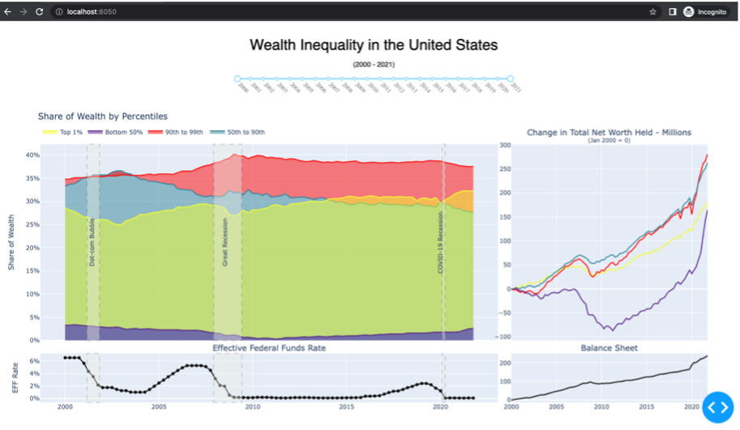

# Impact of Unconventional Monetary Policy on Wealth Inequality in US

## Abstract ##
This research project utilizes visualizations to depict correlations between the Federal Reserve’s monetary policy programs and the emergence of wealth inequality in the United States. The evaluation in determining correlation is dependent on the distribution of wealth by percentiles (Top 1%, 90th- 99th, 50th- 90th, bottom 90%) in coherence with the state of the financial and real economy during the issuance of quantitative easing over recessionary periods. Results reveal evidence supporting a redistribution of wealth from the middle class (50th- 90th) to the upper class (Top 1%) after the COVID-19 recession.

## Dashboard Screenshot ##
<p align="center">
  
  
</p>

## Approach ##

This section describes the approach to evaluating wealth inequality in the United States. From a high-level perspective, my process entailed developing visualizations to depict wealth inequality through two areas of focus: Distribution of Wealth and Financial Economy vs Real Economy. The visualizations reflect data over the years 2000 - 2021. Moreover, I enabled interactivity by allowing the audience to filter years (via range scale) to visualize recessionary periods in detail. Below remark on the design and implementation of visualizations regarding both focus areas.

1. Distribution of Wealth

    To visualize the distribution of wealth in the United States, I relied on two forms of datasets distinguished by percentiles - Top 1%, 90th- 99th, 50th- 90th, and bottom 90%. The first is "Share of Total Net Worth" which pertains to the percent of wealth aggregate owned by each percentile (share of wealth). The second one, "Total Net Worth Held", relates to each percentile’s total net worth (millions) held. Both datasets were obtained from FRED.
    I plotted the "Share of Total Net Worth" dataset using an overlapping area chart. Doing so allows us to visualize changes in the percentage of wealth owned by percentiles across numerous periods.
    
    Furthermore, I downloaded and plotted the "Effective Federal Funds Rate" (EFFR) on a line graph underneath as to indicate unconventional monetary policy issuance.
    For the second dataset, "Total Net Worth Held", I developed a multi-line graph denoting the net worth held by each percentile. However, for better assessment, I indexed that dataset to start at a value of zero on the start date specified by the user. Doing so means that initial dataset values are adjusted so they are equal to zero. Then, the remaining values are normalized to the start value - thus maintaining the same percentage changes as the nonindexed series. The said process allows us to compare growth rates per percentile across the user-specified period. I.e., we can quantify which percentile benefited the most in terms of change in net worth over a recession cycle.

2. Financial Economy vs Real Economy

    For an additional study on wealth inequality, I developed visualizations denoting the state of the US economy. I intentionally distinguished the economy into two categories – financial economy and real economy.

    The financial economy refers to aspects of the economy that pertain to transactions of money and other forms of financial assets. To portray the financial economy, I selected the following datasets off FRED [5]: The purchasing power of USD, S&P 500, and the Median Sales Price of Houses. Again, I indexed that dataset to start at a value of zero on a start date specified by the user. Then, I plotted the datasets on a multi-bar chart. Additionally, I downloaded the dataset "Debt Held by Federal Reserve", indexed the data, and implemented an area chart as a subplot to convey any relationships to the financial economy.

    Real economy refers to the production and flow of goods and services. To represent this, I downloaded the following datasets from FRED [5]: Real GDP, Consumer Sentiment Index, and Industrial production. Then, I indexed that dataset to start at a value of zero on a specific start date defined by the user. Finally, I plotted the dataset on a multi-bar chart.


## Results ##

This section depicts the results of the previously mentioned approach to visualizing wealth inequality in the United States. Results are split into two areas of focus:

__1. Distribution of Wealth__

The United States' wealth distribution is visualized using two datasets – "Share of Total Net Worth" and "Total Net Worth Held". Figure one below depicts visualization for both datasets. Note that the range scale defaults to display data starting in 2000 and ending in 2021. You can see recession cycles annotated in rectangular boxes as shown. 



The plot on the left depicts share of wealth by percentiles through an area chart. The plot on the right illustrates a multi-line graph denoting the change in net worth held by each percentile. Again, take note the data series to depict change in net worth held is indexed to start at a value of zero given user-specified dates – i.e., figure shows Jan 1, 2000, as the start date. Doing so represents the percentage change in net worth per percentile from 2000 to 2021. Additionally, I added subplots underneath depicting the Effective Federal Funds Rate and Balance Sheet. The annotated boxes correspond to the unconventional monetary actions undertaken by the federal reserve given the recessionary period. E.g., you can see the federal funds rate steepen (emergency rate cut) drastically within annotated boxes.

Let's set the range from 2007 to 2010 to confirm Davis's remarks on redistributing wealth from the poor to the rich after the Great Recession [2]. 



Figure two shows that the bottom 50 % suffered the most regarding delta change of net worth held during and after the Great Recession. The visualization on the right shows bottom 50% fell ~80 basis points relative other wealth percentiles. Furthermore, the bottom 50% continued to bleed in net worth held during the recovery phase, while the others bounced back.



Figure three shows the range scale updated to reflect percentiles during and after the COVID-19 recession period. Surprisingly, the effects of the COVID-19 Recession contrast with the Great Recession. The delta changes in net worth held increased for all percentiles during and after the recession. Moreover, the bottom 50% benefited the most - ~100-basis point uptick in the change of total net worth held. However, the top 1 % surpassed the 50th – 90th percentile in terms of share of wealth. By October 2021, the area chart shows the top 1% rose from 30% to 32% in share of wealth, while 50th- 90th percentile decreased from 30% to 28% in share of wealth. Said result is significant as this is the first period (over 2000 to 2021) in which the top 1% owns more share in wealth than the 50th- 90th percentile. Thus, evidence indicates the bottom 50% benefitted while the 50th- 90th percentile deteriorated throughout the COVID-19 Recession. 

__2. Financial Economy vs Real Economy__

As highlighted in the approach section, I developed visualizations to depict the real and financial economy. Associated datasets were indexed to start at a value of 0, given a user-specified start date. Doing so allows us to document changes between economic indicators over a given period. The figure below depicts the financial and real economy from 2000 to 2021



Let's update the range scale to display the financial and real economy during the Great Recession.  



The bar plots were updated to start at value 0 in January 2007. We can see that real and financial economy indicators are in harmony – decreasing. Particularly, consumer sentiment and the S&P 500 are leading the drawdown in both types of economies.

Now let's update the range to reflect economic standing during the COVID-19 Recession. 


  
Figure six shows the results contrast sharply with the Great Recession. Specifically, the financial economy stood to benefit while the real economy deteriorated. Furthermore, you can see the gains in the financial economy are in tangent to the increase in "Debt Held by Federal Reserve". Note that the scenario did not occur during the Great Recession – debt held decreased in harmony with financial markets. The increase in debt held in 2020 is because the federal reserve initiated a quantitative easing program, committing to purchasing at least ~700 billion in assets with no limit [6]. Thus, the visualizations provide convincing evidence to support IMF's hypothesis – unconventional monetary policy programs led to a disconnect between financial markets and the real economy during COVID-19 [3]. Moreover, as previously described by Cui and Sterk – QE policy leads to households owning a more significant fraction of their wealth in highly liquid assets [4]. We can see this is the case given the inverse relationship between purchasing power of USD and S&P 500 - thereby implying a disproportional advantage to asset holders against fiat holders during COVID-19 recession. The said relationship coincides with the top 1% overtaking wealth share from the 50th- 90th percentile. 

 ## Run Instructions ##

 1. Install Required Libraries
    ``` 
    pip install -r requirements.txt
    ```
2.  Execute command (Unix) to run dashboard
    ```
    python src/inequality.py
    ```
3.  Open webpage: http://127.0.0.1:8050/

    


 ## References ##

[1] Emmanuel Saez, Gabriel Zucman, Wealth Inequality in the United States since 1913: Evidence from Capitalized Income Tax Data , The Quarterly Journal of Economics, Volume 131, Issue 2, May 2016, Pages 519–578, https://doi.org/10.1093/qje/qjw004 

[2] Davis, Emily, "Quantitative Easing and Inequality: QE impacts on wealth and income distribution in the United States after the Great Recession" (2019). Economics Theses. 108. https://soundideas.pugetsound.edu/economics_theses/108 

[3]  Igan, D., Kirti, D., & Peria, S. M. (2020). The Disconnect between Financial Markets and the Real Economy. IMF. https://www.imf.org/-/media/Files/Publications/covid19-special-notes/en-special- series-on-covid-19-the-disconnect-between-financial-markets-and-the-real-economy.ashx 

[4] He, C., & Cava, G. L. (2020). The Distributional Effects of Monetary Policy: Evidence from Local Housing Markets. Reserve Bank of
Australia. https://www.rba.gov.au/publications/rdp/2020/pdf/rdp2020-02.pdf 

[5] Federal Reserve Bank, St Louis. (2022). FRED Economic Data. FRED. https://fred.stlouisfed.org/ 

[6] Federal Reserve Board of Governors. (2020, March 5). Federal Reserve issues FOMC statement - March 2020 [Press release]. https://www.federalreserve.gov/newsevents/pressreleases/monetary20200315a.htm

[7] Federal Reserve Bank of Dallas. (n.d.). Indexing Data to a Common Starting Point. https://www.dallasfed.org/research/basics/indexing.aspx
